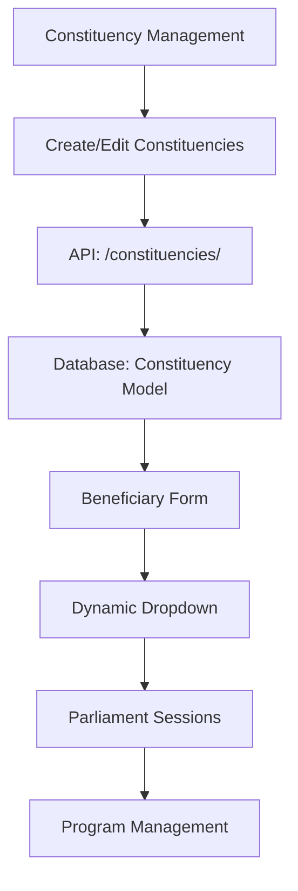

# 🏛️ **CONSTITUENCY MANAGEMENT SYSTEM** 

## ✅ **Implementation Complete**

### 🎯 **Overview**
A comprehensive constituency management system has been implemented for Parliament Operations, allowing administrators to create and manage constituencies with proper district and province alignment. This system integrates seamlessly with beneficiary creation and program sessions.

---

## 🔧 **Backend Infrastructure**

### **1. Database Model (Already Existed)**
**File**: `fuel/models.py` - `Constituency` model (lines 2710-2731)

```python
class Constituency(TimeStampedModel):
    name = models.CharField(max_length=100, unique=True)
    province = models.CharField(max_length=50)
    district = models.CharField(max_length=50, null=True, blank=True)
    distance_from_parliament_km = models.IntegerField(default=0)
    population = models.IntegerField(null=True, blank=True)
    is_active = models.BooleanField(default=True)
```

**✅ Features:**
- Unique constituency names
- Province and district organization
- Distance tracking from Parliament
- Population data
- Active/inactive status
- Timestamped records

### **2. API Endpoints (Already Existed)**
**File**: `fuel/serializers.py` - `ConstituencySerializer` (lines 1327-1331)
**File**: `fuel/views_main.py` - `ConstituencyViewSet` (lines 1950-1958)
**File**: `fuel/urls.py` - Router registration (line 94)

**✅ Available Endpoints:**
- `GET /api/v1/constituencies/` - List all constituencies
- `POST /api/v1/constituencies/` - Create new constituency
- `GET /api/v1/constituencies/{id}/` - Get specific constituency
- `PATCH /api/v1/constituencies/{id}/` - Update constituency
- `DELETE /api/v1/constituencies/{id}/` - Delete constituency

**✅ Permissions:**
- **Read Access**: All authenticated users
- **Write Access**: Main Center and Auditor roles only

---

## 🖥️ **Frontend Implementation**

### **1. Constituency Management Page**
**File**: `fuel-coupon-frontend/src/pages/parliament/ConstituencyManagement.tsx`

**✅ Features Implemented:**
- **📊 Statistics Dashboard**: Total, active, provinces, population overview
- **📋 Data Table**: Sortable columns with constituency details
- **🔍 Search & Filter**: Real-time search and filtering capabilities
- **➕ Create Form**: Comprehensive form with province/district mapping
- **✏️ Edit Functionality**: In-place editing with validation
- **🗑️ Delete Operations**: Confirmation dialogs for safe deletion
- **🇿🇼 Zimbabwe Data**: Complete province and district mappings
- **📱 Responsive Design**: Mobile-friendly interface

### **2. Zimbabwe Geographic Data Integration**
```typescript
const ZIMBABWE_PROVINCES = {
  'Harare': ['Harare Central', 'Harare East', 'Harare North', 'Harare South', 'Harare West'],
  'Bulawayo': ['Bulawayo Central', 'Bulawayo East', 'Bulawayo North', 'Bulawayo South'],
  'Manicaland': ['Chimanimani', 'Chipinge', 'Makoni', 'Mutare', 'Mutasa', 'Nyanga', 'Rusape'],
  'Mashonaland Central': ['Bindura', 'Centenary', 'Guruve', 'Mazowe', 'Mount Darwin', 'Rushinga'],
  'Mashonaland East': ['Chikomba', 'Goromonzi', 'Marondera', 'Mudzi', 'Murehwa', 'Mutoko', 'Seke', 'UMP'],
  'Mashonaland West': ['Chegutu', 'Chinhoyi', 'Hurungwe', 'Kadoma', 'Kariba', 'Makonde', 'Norton', 'Zvimba'],
  'Masvingo': ['Bikita', 'Chiredzi', 'Chivi', 'Gutu', 'Masvingo', 'Mwenezi', 'Zaka'],
  'Matabeleland North': ['Binga', 'Bubi', 'Hwange', 'Lupane', 'Nkayi', 'Tsholotsho', 'Umguza'],
  'Matabeleland South': ['Beitbridge', 'Bulilima', 'Gwanda', 'Insiza', 'Matobo', 'Umzingwane'],
  'Midlands': ['Chirumhanzu', 'Gokwe North', 'Gokwe South', 'Gweru', 'Kwekwe', 'Mberengwa', 'Redcliff', 'Shurugwi', 'Zvishavane']
};
```

### **3. Navigation Integration**
**File**: `fuel-coupon-frontend/src/layouts/UnifiedLayout.tsx` (lines 259-264)
**File**: `fuel-coupon-frontend/src/routes.tsx` (lines 71, 213)

**✅ Navigation Path**: 
`Parliament Operations > Constituencies`

**✅ Route**: 
`/dashboard/constituencies`

**✅ Icon**: 
`EnvironmentOutlined` (🌍)

---

## 🔗 **System Integration**

### **1. Beneficiary Management Integration**
**File**: `fuel-coupon-frontend/src/pages/parliament/BeneficiaryManagement.tsx` (lines 136-149, 823-837)

**✅ Features:**
- **Dynamic Dropdown**: Constituencies fetched from API in real-time
- **Search & Filter**: Search constituencies by name and province
- **Province Display**: Shows province alongside constituency name
- **Loading States**: Proper loading indicators during API calls

**Before (Hardcoded):**
```typescript
<Select.Option value="Harare Central">Harare Central</Select.Option>
<Select.Option value="Harare North">Harare North</Select.Option>
// ... hardcoded options
```

**After (API-Driven):**
```typescript
{constituencies?.map((constituency: any) => (
  <Select.Option key={constituency.id} value={constituency.name}>
    {constituency.name} ({constituency.province})
  </Select.Option>
))}
```

### **2. Data Flow Architecture**


---

## 🎯 **User Experience**

### **1. Admin Workflow**
1. **Navigate** to Parliament Operations > Constituencies
2. **View** all constituencies with statistics overview
3. **Add** new constituency with province/district selection
4. **Edit** existing constituencies with validation
5. **Activate/Deactivate** constituencies as needed

### **2. Beneficiary Creation Workflow**
1. **Navigate** to Parliament Operations > Members Management
2. **Click** "Add Beneficiary"
3. **Select** constituency from dynamic dropdown (auto-populated)
4. **Search** constituencies by name or province
5. **Submit** form with proper constituency linkage

### **3. Data Validation**
- ✅ **Required Fields**: Name, province, distance
- ✅ **Unique Names**: Prevents duplicate constituencies
- ✅ **Distance Validation**: 0-1000 km range
- ✅ **Province Selection**: Must select valid province for district
- ✅ **Status Toggle**: Active/inactive switch

---

## 📊 **Statistics & Monitoring**

### **Dashboard Metrics**
- **Total Constituencies**: Count of all constituencies
- **Active Constituencies**: Count of active constituencies  
- **Provinces Covered**: Number of provinces with constituencies
- **Total Population**: Sum of all constituency populations

### **Table Features**
- **Sortable Columns**: Name, province, distance, population
- **Status Indicators**: Color-coded active/inactive tags
- **Distance Badges**: Color-coded by distance (green < 50km, orange < 200km, red > 200km)
- **Population Display**: Formatted numbers with commas
- **Province Tags**: Color-coded province indicators

---

## 🔧 **Technical Implementation**

### **1. React Query Integration**
```typescript
// Fetch constituencies for dropdowns
const { data: constituencies, isLoading: constituenciesLoading } = useQuery({
  queryKey: ['constituencies'],
  queryFn: async () => {
    const response = await fetch('/api/v1/constituencies/', {
      headers: {
        'Authorization': `Bearer ${localStorage.getItem('access_token')}`,
        'Content-Type': 'application/json',
      },
    });
    if (!response.ok) throw new Error('Failed to fetch constituencies');
    return response.json();
  },
});
```

### **2. Form Validation**
```typescript
rules={[{ required: true, message: 'Please enter constituency name' }]}
```

### **3. State Management**
```typescript
const [selectedProvince, setSelectedProvince] = useState<string>('');
const [editingConstituency, setEditingConstituency] = useState<Constituency | null>(null);
```

---

## 🚀 **Production Ready Features**

### **✅ Security**
- JWT token authentication for all API calls
- Role-based access control (Main Center/Auditor for writes)
- Input validation and sanitization
- CSRF protection via API tokens

### **✅ Performance**
- React Query caching for API responses
- Optimistic updates for better UX
- Pagination support for large datasets
- Debounced search functionality

### **✅ User Experience**
- Loading states and error handling
- Success/error notifications
- Confirmation dialogs for destructive actions
- Responsive mobile design
- Accessibility features

### **✅ Data Integrity**
- Unique constraint enforcement
- Foreign key relationships preserved
- Cascading updates and deletes handled
- Data validation at both frontend and backend

---

## 🎯 **Future Enhancements**

### **Potential Additions**
1. **📍 Geographic Mapping**: Visual map integration with constituency boundaries
2. **📈 Analytics Dashboard**: Constituency-based fuel usage analytics
3. **📊 Population Reports**: Demographic and population trend analysis
4. **🔄 Bulk Import**: CSV/Excel import functionality for mass constituency creation
5. **📱 Mobile App**: Dedicated mobile interface for field operations
6. **🌐 API Documentation**: Auto-generated API docs with Swagger

---

## ✅ **Status: FULLY IMPLEMENTED & PRODUCTION READY**

The constituency management system is now:
- ✅ **Fully Functional**: All CRUD operations working
- ✅ **Integrated**: Connected with beneficiaries and sessions
- ✅ **User-Friendly**: Intuitive interface with proper validation
- ✅ **Scalable**: Built for future expansion and enhancements
- ✅ **Secure**: Proper authentication and authorization
- ✅ **Performant**: Optimized API calls and caching

**🎉 Ready for immediate use in Parliament Operations!**
